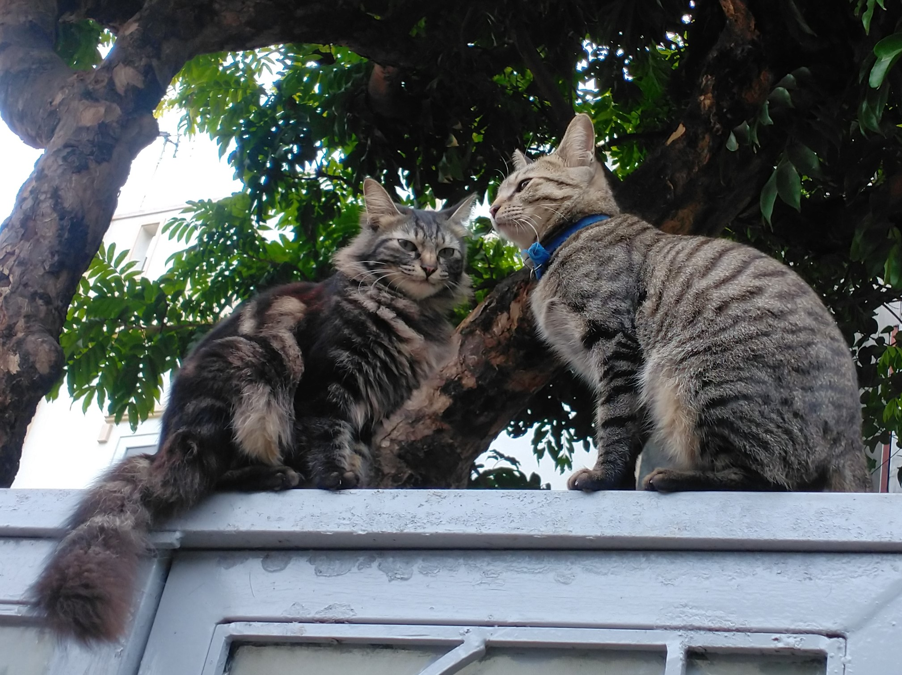

<h1 align="left">Hey  What's up?</h1>

###

  
  
  

---

###

### Languages:

 

### Tools:

 

### Libraries and Frameworks:

 

### Databases:

 

### Others:

 

---

  
  
  

###

 

<picture>
  <source media="(prefers-color-scheme: dark)" srcset="https://raw.githubusercontent.com/linhnvh15vn/linhnvh15vn/output/github-contribution-grid-snake-dark.svg">
  <source media="(prefers-color-scheme: light)" srcset="https://raw.githubusercontent.com/linhnvh15vn/linhnvh15vn/output/github-contribution-grid-snake.svg">
  
</picture>

###
